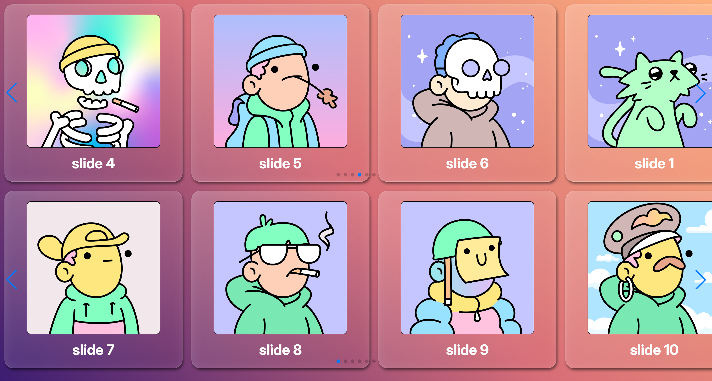

<div align="center">


_screenshot_

</div>

## 🚀 Запуск

https://alex-zander-0403.github.io/test-fouro/

На странице размещено несколько слайдеров, каждый со своей разметкой:

```
<div class=«swiper-1 swiper>
  <div class="swiper-wrapper">
    <div class="swiper-slide">Слайд 1</div>
    <div class="swiper-slide">Слайд 2</div>
    <div class="swiper-slide">Слайд 3</div>
  </div>
  <div class="swiper-pagination"></div>
  <div class="swiper-button-prev"></div>
  <div class="swiper-button-next"></div>
</div>

<div class=«swiper-2 swiper>
  <div class="swiper-wrapper">
    <div class="swiper-slide">Слайд 1</div>
    <div class="swiper-slide">Слайд 2</div>
    <div class="swiper-slide">Слайд 3</div>
  </div>
  <div class="swiper-pagination"></div>
  <div class="swiper-button-prev"></div>
  <div class="swiper-button-next"></div>
</div>
```

// И так далее..

Необходимо:

1.  Инициализировать все слайдеры на странице с помощью Swiper.js.

2.  При ширине окна меньше 1200px — уничтожать все слайдеры, чтобы они отображались как обычный статичный список.

3.  При увеличении ширины обратно до 1200px и выше — повторно инициализировать слайдеры.

4.  Избежать повторной инициализации или повторного уничтожения, если состояние уже соответствует условию.

5.  Сделать аккуратный внешний вид на десктоп и мобильном устройстве (~320px). Добавить эффекты наведения и прочее, на свое усмотрение. Можно добавить картинки, текст, любую разметку на свое усмотрение, чтобы выглядело красиво.
